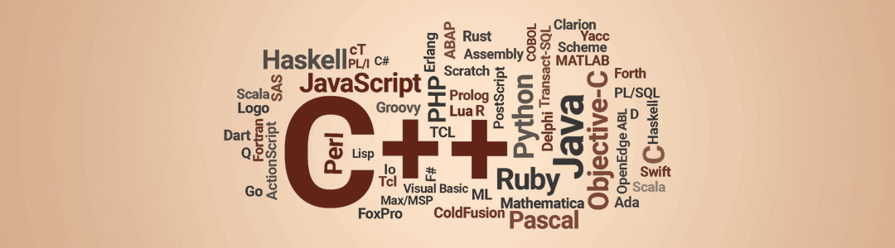

# Hey, I am [Darie](https://www.linkedin.com/in/dmitoiu)!

Hi, **I am Darie**, but I go by **dmitoiu on the internet**. Apart from programming I am interested in networking, cryptography, machine learning, database administration and engineering in general. 
I also do [graphics](https://github.com/dmitoiu/Limbaje-De-Programare-Footage) as the animation above.

I help companies with API development and software engineering on freelance basis in the European Union and Worldwide. In the past I have enjoyed collaborating with Machine Learning Engineers and Data Scientists to help put their Experiments into Production.

I am interested in permanent or fixed-term contracts working with C#, PHP, JavaScript or Python.

If you are interested in software services, [Get in Touch!](mailto:dmitoiu@hotmail.com)

[Curriculum Vitae](https://github.com/dmitoiu/Curriculum-Vitae/blob/master/Darie-Dragos_Mitoiu_Resume.pdf)

