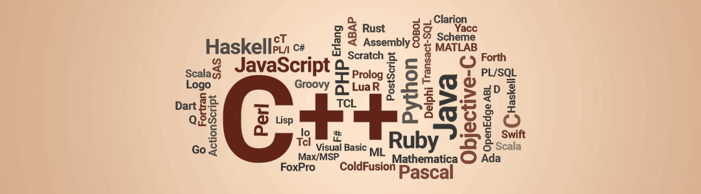

# Hey, I am [Darie](https://www.linkedin.com/in/dmitoiu)!

Hi, **I am Darie**, but I go by **dmitoiu on the internet**. Apart from programming I am interested in networking,
cryptography, machine learning, database administration and engineering in general.
I also do [graphics](https://github.com/dmitoiu/Limbaje-De-Programare-Footage) as the animation above.

I help companies with API development and software engineering in the European Union.
In the past I have enjoyed collaborating with Machine Learning Engineers and Data Scientists to help put their 
Experiments into Production.

I’m particularly focused on building maintainable and scalable code across both client and server side.
I’ve worked on a range of projects, from enterprise tools to academic research applications, 
and I’m always looking for ways to improve systems designs.

If you are interested in software services, [Get in Touch!](mailto:dmitoiu@hotmail.com)

